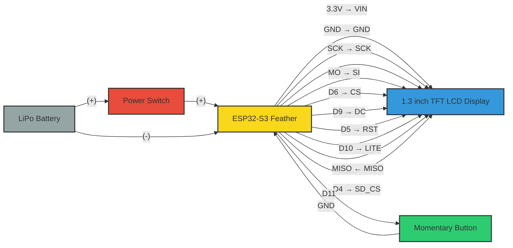

# Wiring Instructions: Adafruit ESP32-S3 Feather to Adafruit 1.3" 240x240 TFT LCD (ST7789)

This guide provides detailed instructions for connecting the Adafruit 1.3" 240x240 Wide Angle TFT LCD Display with MicroSD (ST7789) to the Adafruit ESP32-S3 Feather.

## Wiring Diagram




## Components Required

1. [Adafruit ESP32-S3 Feather](https://www.adafruit.com/product/5477)
2. [Adafruit 1.3" 240x240 Wide Angle TFT LCD Display with MicroSD - ST7789](https://www.adafruit.com/product/4313)
3. Jumper wires or a custom PCB
4. Optional: LiPo battery for portable operation
5. Momentary push button switch (normally open)
6. SPST power switch (for battery-powered configurations)

## Pin Connections

Connect the following pins between the ESP32-S3 Feather and the 1.3" TFT LCD Display:

| ESP32-S3 Feather | 1.3" TFT LCD Display (ST7789) | Function |
|------------------|-------------------------------|----------|
| 3.3V             | VIN                           | Power    |
| GND              | GND                           | Ground   |
| SCK              | SCK                           | SPI Clock |
| MO               | SI                            | SPI Data Out |
| D6               | CS                            | Chip Select |
| D9               | DC                            | Data/Command |
| D5               | RST                           | Reset    |
| D10              | LITE                          | Backlight Control |

## MicroSD Card Connections (Optional)

If you want to use the MicroSD card slot on the display:

| ESP32-S3 Feather | 1.3" TFT LCD Display (ST7789) | Function |
|------------------|-------------------------------|----------|
| MISO             | MISO                          | SPI Data In |
| Any available GPIO pin (e.g., D4) | SD_CS        | SD Card Chip Select |

**Note:** If using the SD card, you'll need to initialize it separately in your code with the appropriate SD card chip select pin.

## Display Configuration

The display is configured in the code with the following parameters:

```python
display = ST7789(
    display_bus, 
    rotation=0,
    width=240, 
    height=240, 
    rowstart=80, 
    auto_refresh=False, 
    backlight_pin=lcd_light, 
    brightness=0
)
```

## Power Considerations

- The display can be powered from the 3.3V output of the ESP32-S3 Feather.
- When using a battery, monitor the battery level to prevent unexpected shutdowns.
- The backlight brightness can be adjusted in the code to save power.
- Use the power switch to completely disconnect the battery when the device is not in use to extend battery life.
- For maximum power efficiency, consider implementing sleep modes in your code when the device is idle.

## Physical Installation

1. Ensure all connections are secure and properly insulated.
2. Double-check the pin connections before powering on.
3. If using in a portable project, consider proper mounting to prevent stress on the connections.

## Troubleshooting

- **Display not working:** Check all connections, especially CS, DC, and RST pins.
- **Garbled display:** Verify SPI connections and ensure proper initialization in code.
- **No backlight:** Check the LITE pin connection and brightness setting in code.
- **SD card not detected:** Verify MISO and SD_CS connections if using the SD card functionality.
- **No power to device:** Verify the power switch is in the ON position and check battery connections.
- **Intermittent power issues:** Check for loose connections at the power switch terminals.

## Switch Connection

A momentary push button switch can be connected to display a specific image when pressed:

| ESP32-S3 Feather | Switch | Function |
|------------------|--------|----------|
| D11              | Pin 1  | Switch Input |
| GND              | Pin 2  | Ground |

### Switch Configuration

The switch is configured in the code as follows:

```python
switch_pin = digitalio.DigitalInOut(board.D11)
switch_pin.direction = digitalio.Direction.INPUT
switch_pin.pull = digitalio.Pull.UP  # Use pull-up resistor
switch = Debouncer(switch_pin)
```

### Switch Function

The switch serves as an interactive element that allows the user to display a specific image (IMG3) when pressed. When the button is pressed, the normal sequence is interrupted, and the third image is displayed. When the button is released, the display returns to the normal sequence.

This functionality is useful for:
- Displaying additional information on demand
- Showing a QR code or contact information
- Creating an interactive element in your project

The switch uses a pull-up resistor configuration, which means:
- The input reads HIGH (True) when the button is NOT pressed
- The input reads LOW (False) when the button IS pressed

## Power Switch Connection

A power switch is recommended for controlling power to the device, especially in battery-powered configurations:

| Component 1 | Component 2 | Function |
|-------------|-------------|----------|
| LiPo Battery (+) | Power Switch | Power Input |
| Power Switch | ESP32-S3 Feather (BAT) | Power Output |
| LiPo Battery (-) | ESP32-S3 Feather (GND) | Ground |

### Power Switch Recommendations

1. **Switch Type:** SPST (Single Pole, Single Throw) toggle or slide switch
2. **Current Rating:** At least 1A to handle peak current draws
3. **Voltage Rating:** At least 5V for LiPo battery applications

### Installation Tips

1. Place the power switch in an easily accessible location on your project enclosure.
2. Ensure all power connections are secure and properly insulated to prevent shorts.
3. Consider adding strain relief to the battery and switch connections to prevent wire fatigue.
4. For extended battery life, disconnect the battery when storing the device for long periods.

### Power Management

The power switch provides a simple way to completely disconnect the battery from the circuit, which:
- Prevents battery drain when the device is not in use
- Allows for safe battery replacement or maintenance
- Provides an emergency cutoff in case of circuit malfunction
